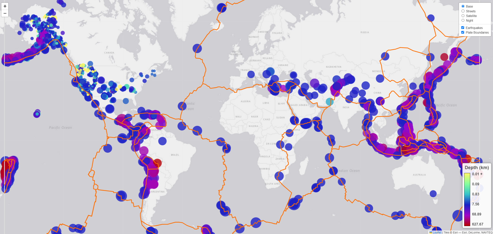
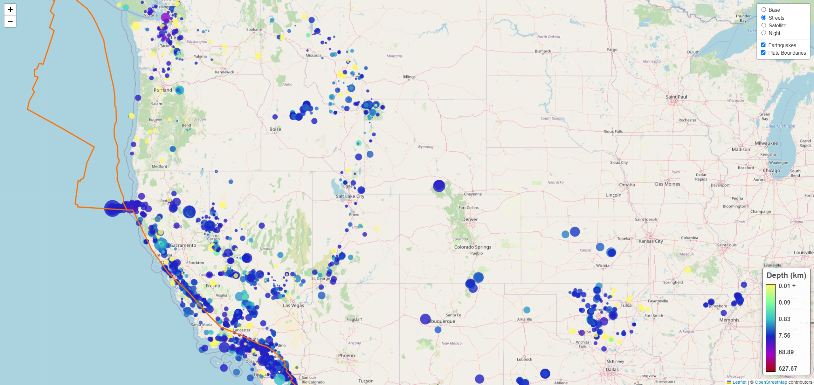

# Challenge 15 - Leaflet

This challenge demonstrates the usage of JavaScript to visualize data on a map using `Leaflet.js`.

Earthquake data for the **past 30 days** is collected from the [USGS Earthquake Hazards Program](https://earthquake.usgs.gov/earthquakes/feed/v1.0/geojson.php). The map displays each earthquake as a circle. The radius of the circle is proportional to its magnitude while the color changes depending its depth. The depth is on a logarithmic scale as displayed in the legend. When clicking on a circle marker, a popup will appear with the location, depth, magnitude and date of the earthquake.

There are four base maps to choose from along with the ability to turn on or off the earthquake markers and the plate boundaries. By displaying the plate boundaries layer, it becomes obvious that the vast majority of earthquakes occur at these boundaries.

When studying the map, we can also see that, while the USGS keeps of earthquakes around the world, it only does so for the larger magnitude (>4.0), while smaller magnitude earthquakes are only tracked within the US. These small magnitude quakes are also the ones closest to the surface.

The website can be accessed at: [https://zachaa.github.io/leaflet-challenge/](https://zachaa.github.io/leaflet-challenge/)

## Website Preview

### US Closeup

---
### Sources and Packages:
- [USGS](https://earthquake.usgs.gov/earthquakes/feed/v1.0/geojson.php)
- [Tectonic Plates](https://github.com/fraxen/tectonicplates) (copy of JSON data found in [data/](data/PB2002_boundaries.json))
- [D3.js](https://d3js.org/)
- [Leaflet](https://leafletjs.com/)
- [chroma.js](https://gka.github.io/chroma.js/) (for gradient)